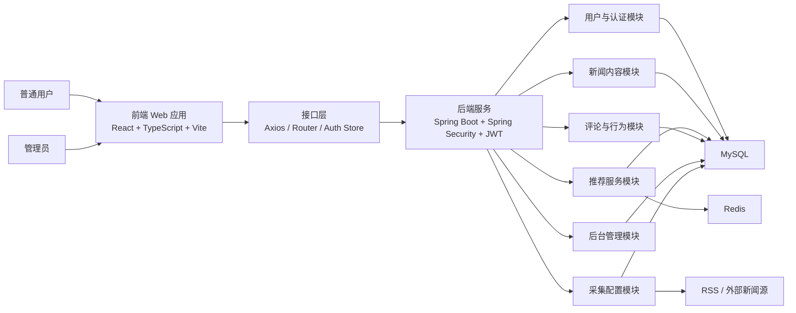
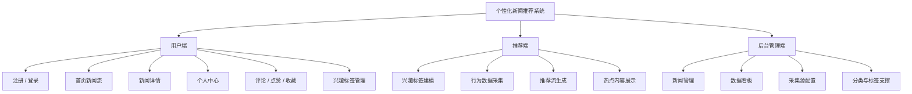
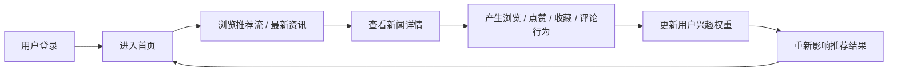
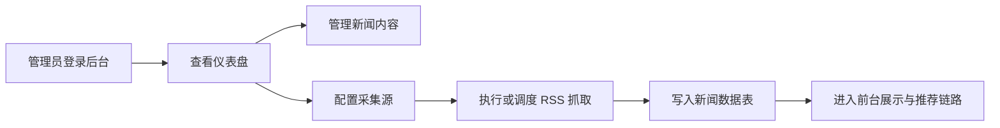

# 个性化新闻推荐系统

[](https://www.oracle.com/java/)
[](https://spring.io/projects/spring-boot)
[](https://react.dev/)
[](https://www.typescriptlang.org/)
[](https://www.mysql.com/)
[](https://redis.io/)

一个面向毕业设计场景开发的全栈项目，目标是构建一套兼顾内容展示、用户兴趣建模、行为采集、推荐分发与后台管理的新闻推荐系统。当前版本已经完成前后端基础架构与核心业务闭环，适合作为初始答辩版本、中期展示版本和后续优化迭代的基础。

## 答辩演示快速启动

本项目已经做过一轮最小安全修复，目标是保证毕业设计答辩阶段“能稳定启动、权限边界清晰、明显安全问题已收口”，同时尽量不破坏现有功能。

### 1. 后端启动前准备

请先准备本地 MySQL，并创建数据库：

```sql
CREATE DATABASE news_recommendation DEFAULT CHARACTER SET utf8mb4 COLLATE utf8mb4_unicode_ci;
```

后端现在强制通过环境变量读取数据库和 JWT 配置，不再允许使用默认弱密钥。

PowerShell 示例：

```powershell
$env:SPRING_PROFILES_ACTIVE="dev"
$env:DB_HOST="127.0.0.1"
$env:DB_PORT="3306"
$env:DB_NAME="news_recommendation"
$env:DB_USERNAME="root"
$env:DB_PASSWORD="你的MySQL密码"
$env:JWT_SECRET="请替换为长度至少32位的随机字符串"
```

启动后端：

```powershell
cd backend
mvn spring-boot:run
```

健康检查：

```text
GET http://localhost:8080/api/health
```

### 2. 前端启动

```powershell
cd frontend
npm install
npm run dev
```

默认访问地址：

```text
http://localhost:5173
```

### 3. 本轮最小修复说明

- JWT secret 改为必填环境变量，避免默认 `change-me-in-dev` 被伪造 token。
- 禁用用户会在 JWT 过滤器层被拦截，旧 token 不再继续访问受保护接口。
- 采集源增加轻量 SSRF 防护，只允许 `http/https`，并拒绝 `localhost`、`127.*`、`169.254.*` 及常见内网地址。
- 点赞、收藏、评论计数改为原子更新，降低答辩演示时并发连点导致计数错误的概率。
- 前端遇到 `401` 会自动清理登录态并拉起登录框，避免页面停在异常状态。

## 项目概览

- 项目名称：个性化新闻推荐系统
- 项目定位：毕业设计 / 推荐系统原型 / 全栈工程实践项目
- 前端技术：React 19、TypeScript、Vite、React Router、Axios
- 后端技术：Spring Boot 3、Spring Security、MyBatis-Plus、JWT
- 数据支撑：MySQL、Redis
- 当前状态：已完成基础功能闭环，可继续扩展推荐算法与工程能力

## 项目背景

在信息过载越来越明显的环境下，用户获取内容的难点已经不再只是“有没有信息”，而是“怎样更快地获得更适合自己的信息”。传统新闻平台通常以时间排序或热点排序为主，但这种方式难以持续满足个体化阅读需求。

本项目以“个性化新闻推荐”为毕业设计主题，尝试结合用户兴趣标签、浏览行为、点赞、收藏、评论等交互数据，构建一个具备基础推荐能力的新闻系统。项目不仅关注推荐结果本身，也关注一个完整系统应具备的用户端体验、后台管理能力与后续扩展空间。

## 开发历程

1. 明确毕业设计方向，确定以“新闻推荐系统”为核心题目，并将目标拆分为内容管理、用户系统、行为采集、推荐逻辑和后台运营几个模块。
2. 完成后端 Spring Boot 项目初始化，搭建用户、新闻、分类、标签、评论、行为记录、兴趣权重与采集配置等数据模型。
3. 完成前端 Vite + React 工程搭建，逐步实现首页、新闻详情、个人中心和管理端页面。
4. 接入登录鉴权、基础权限控制、接口封装与前后端联调，形成可运行的业务闭环。
5. 增加推荐流、热门流、分类筛选、个人兴趣更新、用户行为采集和后台统计能力，使系统具备更完整的“推荐平台”特征。

## 系统架构图



## 功能结构图



## 核心流程图

### 用户阅读与推荐流程



### 后台内容运营流程



## 页面演示导览

当前前端已经具备以下核心页面，适合用于课程展示和答辩演示：

| 页面 | 说明 | 对应文件 |
| --- | --- | --- |
| 首页 | 展示推荐流、最新资讯、热门内容、分类筛选与关键词搜索 | `frontend/src/pages/HomePage.tsx` |
| 新闻详情页 | 查看新闻正文与相关交互 | `frontend/src/pages/NewsDetailPage.tsx` |
| 个人中心 | 展示用户信息、兴趣偏好与个人交互相关内容 | `frontend/src/pages/ProfilePage.tsx` |
| 管理后台 | 管理新闻、查看统计、配置采集源 | `frontend/src/pages/AdminDashboardPage.tsx` |
| 登录弹窗 | 统一处理登录与注册交互 | `frontend/src/components/AuthModal.tsx` |

## 主要功能

### 用户端功能

- 新闻首页展示，支持最新资讯与推荐内容切换
- 热门新闻展示
- 新闻分类与关键词检索
- 新闻详情查看
- 登录 / 注册
- 用户个人中心
- 用户兴趣标签维护
- 浏览、点赞、收藏、评论等行为记录

### 推荐相关功能

- 基于用户兴趣标签进行内容偏好建模
- 基于用户行为数据进行推荐结果调整
- 支持推荐流与普通新闻流切换
- 为后续升级协同过滤、内容召回和排序模型预留接口基础

### 后台管理功能

- 后台新闻管理
- 后台新闻统计看板
- 新闻分类与标签支撑
- 采集源配置管理
- RSS 抓取任务基础能力
- 用户行为与内容热度支撑

## 技术栈

### 前端

- React 19
- TypeScript
- Vite
- React Router
- Axios

### 后端

- Java 17
- Spring Boot 3
- Spring Security
- MyBatis-Plus
- MySQL
- Redis
- JWT

## 项目结构

```text
graduation_design/
├─ backend/   # Spring Boot 后端
├─ frontend/  # React 前端
└─ README.md
```

## 后端核心模块

- `AuthController`：登录、注册与身份认证
- `NewsController`：新闻列表、详情、热点内容
- `RecommendController`：推荐流接口
- `CommentController`：评论相关功能
- `ProfileController`：个人中心与用户数据
- `UserBehaviorController`：用户行为采集
- `AdminNewsController`：后台新闻管理
- `AdminDashboardController`：后台统计面板
- `AdminCrawlConfigController`：采集源配置管理

## 数据模型摘要

当前后端已经设计并初始化了以下核心业务实体：

- 用户 `user`
- 分类 `category`
- 标签 `tag`
- 新闻 `news`
- 新闻标签关系 `news_tag`
- 用户兴趣 `user_interest`
- 用户行为 `user_behavior`
- 评论 `comment`
- 采集配置 `crawl_config`

这些表共同支撑了“新闻内容管理 + 用户画像 + 推荐链路 + 后台运营”的系统闭环。

## 运行环境

建议使用以下环境：

- Node.js 20+
- npm 10+
- Java 17
- Maven 3.9+
- MySQL 8.x
- Redis 6.x 或更高版本

## 本地启动方式

### 1. 启动后端

后端默认端口为 `8080`。

可通过环境变量配置数据库和 JWT：

- `DB_HOST`
- `DB_PORT`
- `DB_NAME`
- `DB_USERNAME`
- `DB_PASSWORD`
- `JWT_SECRET`

在 `backend` 目录下运行：

```bash
mvn spring-boot:run
```

### 2. 启动前端

前端默认通过 `VITE_API_BASE_URL` 访问后端接口，未设置时默认走 `/api`。

在 `frontend` 目录下运行：

```bash
npm install
npm run dev
```

如需显式指定接口地址，可在启动前设置：

```bash
VITE_API_BASE_URL=http://localhost:8080
```

### 3. 构建前端

```bash
npm run build
```

## 演示建议

如果需要做课堂展示或答辩演示，建议按下面顺序进行：

1. 展示首页，说明推荐流与最新资讯流的切换逻辑。
2. 演示搜索、分类筛选与热门内容区域。
3. 进入新闻详情页，说明内容展示与交互行为采集。
4. 展示个人中心，介绍用户兴趣与个性化推荐关系。
5. 切换到后台页面，展示数据看板、新闻管理与采集源配置。
6. 最后回到 README 中的架构图和流程图，总结系统设计思路。

## 当前版本说明

当前版本已经完成：

- 前后端基础工程搭建
- 主要业务表结构设计与初始化数据
- 登录鉴权与权限控制基础能力
- 新闻浏览、搜索、分类筛选、评论和推荐闭环
- 后台新闻管理与采集配置基础功能

这是一个适合“毕业设计初始答辩 / 中期展示 / 继续深挖”的版本，已经具备清晰的系统结构和较强的扩展性。

## 版本记录 / 提交记录

为方便课程检查、答辩说明和后续迭代追踪，当前仓库将重要阶段性成果同步记录在 `README` 中。后续每次功能性提交或文档性提交，原则上都应同步更新本节内容。

| 版本阶段 | 提交 ID | 提交说明 | 本次完成任务 |
| --- | --- | --- | --- |
| v0.1 初始系统版本 | `16fbfce` | `feat: initial system version` | 完成前后端分离架构搭建，采用 Spring Boot + React 方案；完成用户系统、登录注册、JWT 鉴权与基础权限控制；完成新闻模块、评论模块、个人中心模块、后台管理模块；完成采集配置、RSS 抓取基础能力、兴趣建模与推荐过滤逻辑基础闭环。 |
| v0.2 项目文档补充 | `9eeeff1` | `docs: add project README` | 新增项目 `README.md`，补充项目背景、开发历程、功能模块、技术栈、运行方式、优化方向与作者说明。 |
| v0.3 README 展示增强 | `f998952` | `docs: enrich README with diagrams` | 在 `README` 中新增系统架构图、功能结构图、用户推荐流程图、后台运营流程图、页面演示导览与更直观的项目展示信息。 |

### 维护约定

- 后续每次 `push` 前，如本次工作涉及功能、结构、文档或演示材料变化，应同步更新本节。
- 如果是较大的功能迭代，建议新增一行版本记录，并写清“提交 ID + 本次完成任务 + 对应模块”。
- 如果只是小修复，可在提交信息中简明说明，必要时不单独扩充版本阶段，但建议至少保持 Git 提交标题可读。
- 若后续进入答辩冲刺阶段，可继续按 `v0.4`、`v0.5` 的形式追加，例如“推荐算法优化”“部署说明补充”“测试体系补充”等。

## 后续优化与升级空间

### 推荐算法层面

- 引入更细粒度的用户画像建模
- 增加协同过滤、内容相似度召回与混合推荐策略
- 引入行为时间衰减与多目标排序
- 增加点击率、收藏率、停留时长等指标驱动的动态权重调整

### 工程与架构层面

- 增加统一配置文件与多环境部署方案
- 补充单元测试、集成测试和接口测试
- 优化异常处理、日志追踪和监控告警
- 引入缓存优化与接口性能调优
- 拆分推荐服务、采集服务和管理服务，向微服务方向演进

### 产品体验层面

- 增加更完善的后台用户管理
- 增加新闻审核流与内容状态管理
- 增加推荐解释能力，提升推荐透明度
- 支持更多交互行为，如历史记录、稍后阅读、订阅主题
- 增加移动端适配与界面细节优化

## 作者说明

本项目由一名正在进行毕业设计的学生独立规划并持续开发，重点放在“完整系统落地能力”上，而不仅仅是单一算法实现。项目既体现了对推荐系统业务逻辑的理解，也体现了前后端联动、数据库设计、权限控制、管理端实现和系统迭代思路。

如果后续继续完善，本项目可以进一步扩展为一个更完整的内容推荐平台，用于课程答辩、作品集展示或进一步的工程实践。

## 仓库说明

当前仓库用于保存本项目的阶段性成果与后续迭代版本。建议后续继续按功能模块或里程碑进行提交，逐步完善：

- 文档说明
- 测试体系
- 推荐算法效果
- 部署方案
- 产品体验细节

---

如果你正在查看这个仓库，那么它记录的是一个毕业设计项目从“想法”走向“系统原型”的完整起点。
## 2026-05 Minimal Security Fix Notes

This project now requires environment variables for JWT and database startup.

Backend config files:
- `backend/src/main/resources/application.yml`
- `backend/src/main/resources/application-dev.yml`

Recommended local startup on Windows PowerShell:

```powershell
$env:SPRING_PROFILES_ACTIVE="dev"
$env:DB_HOST="127.0.0.1"
$env:DB_PORT="3306"
$env:DB_NAME="news_recommendation"
$env:DB_USERNAME="root"
$env:DB_PASSWORD="your-local-mysql-password"
$env:JWT_SECRET="replace-with-a-long-random-secret-at-least-32-bytes"
cd backend
mvn spring-boot:run
```

Frontend startup:

```powershell
cd frontend
npm install
npm run dev
```

Important notes:
- `JWT_SECRET` is mandatory.
- `JWT_SECRET=change-me-in-dev` is forbidden and the backend will fail fast.
- Crawl source URLs only allow `http/https` and reject localhost, loopback, link-local, and common private network IPs.
- When a user is disabled, existing JWT access will be rejected on the next request.
